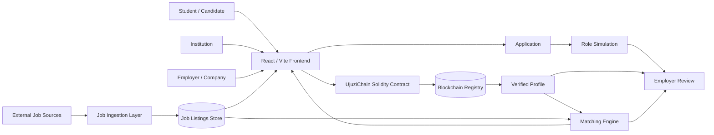

# UjuziChain Updated System Architecture

## Design principles

- **Open discovery:** every registered candidate can browse all job listings, regardless of match score or document status.
- **Matching as guidance:** verified credentials and skills generate a 0–100% match score, but the score does not block applications.
- **Simulation as additional evidence:** candidates can complete role-specific practical simulations when their profile has a low match or when they want to demonstrate capability beyond their documents.
- **Automatic job ingestion:** production integrations should use approved APIs, partner feeds, ATS connectors, RSS/feed mechanisms, or permitted company career-page integrations. The MVP simulates this synchronization.
- **Blockchain scope:** the blockchain registry is used for credential integrity, issuer information, timestamps, and validity/revocation status; sensitive source documents should remain off-chain.
