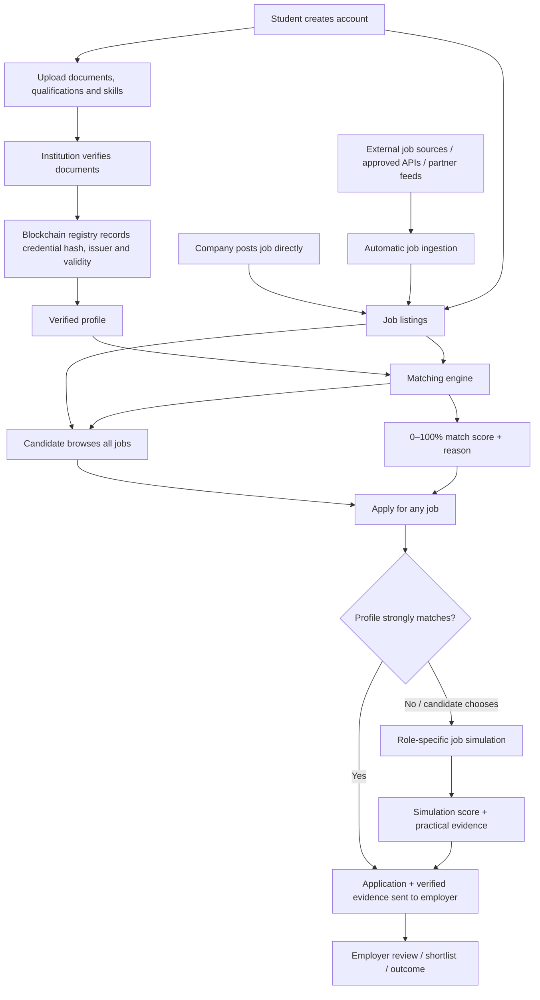

# UjuziChain Credential, Job Discovery and Simulation Flow

The updated workflow removes credential verification as a gate to viewing jobs. Verification strengthens the candidate profile and match score, while opportunity discovery remains open to all registered candidates.

## Key change from the earlier design

Previously, the workflow implied that verified profiles were required before job-listing access. In this version:

1. A registered candidate can view **all job listings**.
2. A candidate can apply even when the match score is low.
3. The platform can recommend a **job simulation** similar in purpose to virtual work-experience assessments: practical tasks produce additional evidence for the application.
4. Job listings can be synchronized from external sources through permitted integrations, in addition to jobs posted directly by companies.
5. Verified blockchain credentials remain valuable for trust and matching, but they are not used as a barrier to opportunity.
