# UjuziChain Screenshots

This directory contains screenshots from the initial UjuziChain software demonstration.

They document both the development environment and the current MVP frontend.

---

## Development Environment

### Node and npm Versions

Shows the Node.js and npm versions used for the project.

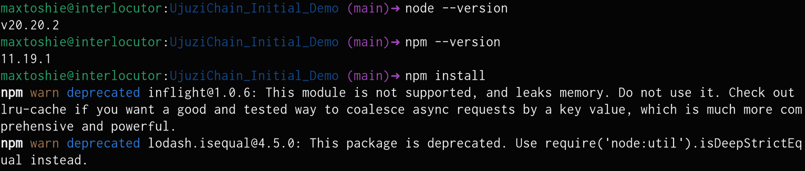

### Smart Contract Compilation

Shows the Solidity smart contract compiling successfully with Hardhat.

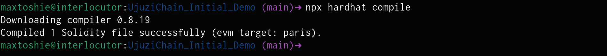

### Smart Contract Tests

Shows the automated smart contract tests passing successfully.

The tests cover:

- Admin initialization
- Institution registration
- Unauthorized institution registration
- Student registration
- Credential issuance
- Credential verification
- Credential revocation

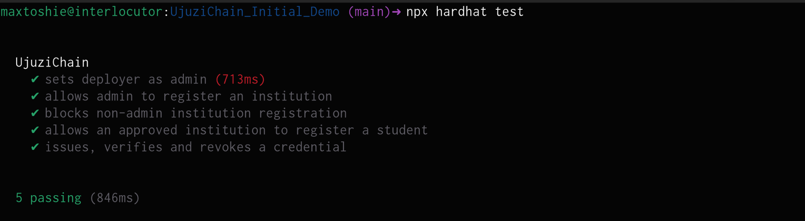

### Smart Contract Code

Shows part of the Solidity smart contract used by UjuziChain.

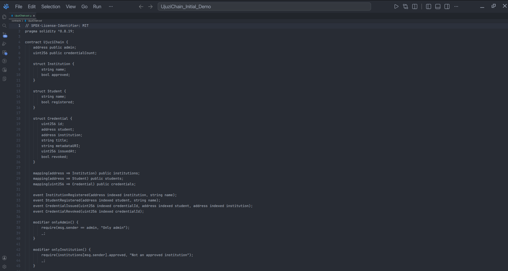

### Hardhat Local Network

Shows the local Hardhat Ethereum development network running.

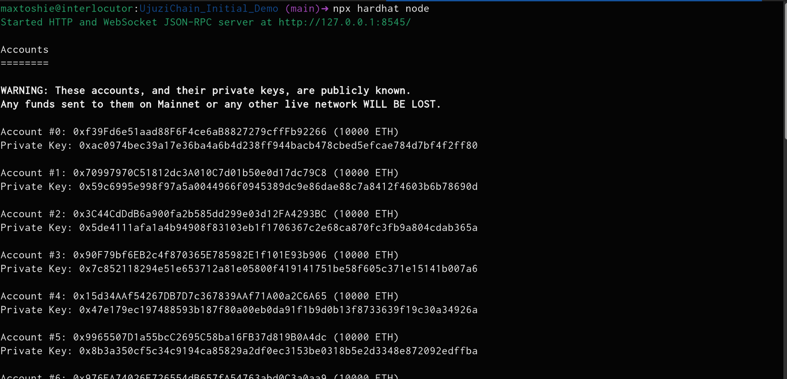

### Smart Contract Deployment

Shows the UjuziChain smart contract successfully deployed to the local Hardhat network.

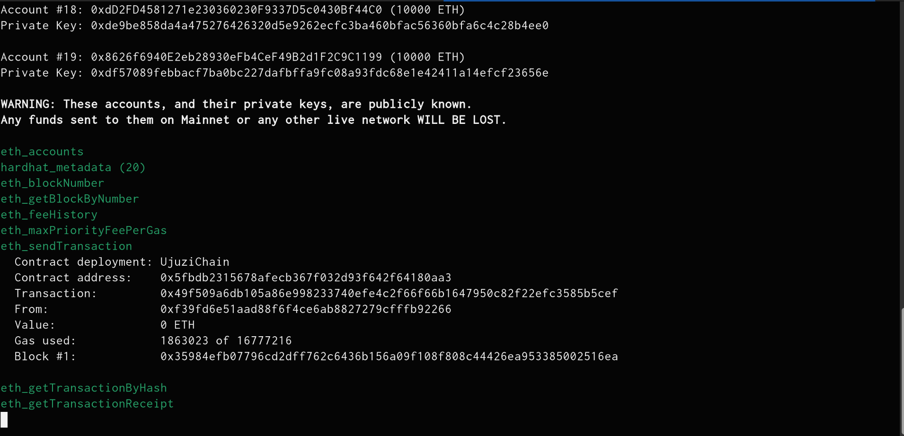

---

## Frontend

### Overview

The overview page provides access to the main candidate features:

- Jobs
- Applications
- Simulations
- Credentials
- Credential verification

It also shows that all registered candidates have access to job listings regardless of their match score.

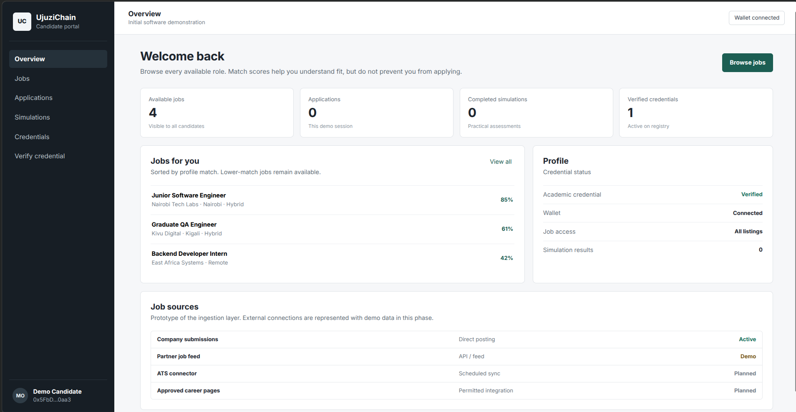

### Job Listings

The jobs page displays all available jobs together with their calculated match scores.

The match score is advisory. A candidate can still view and apply for a job even when their score is low.

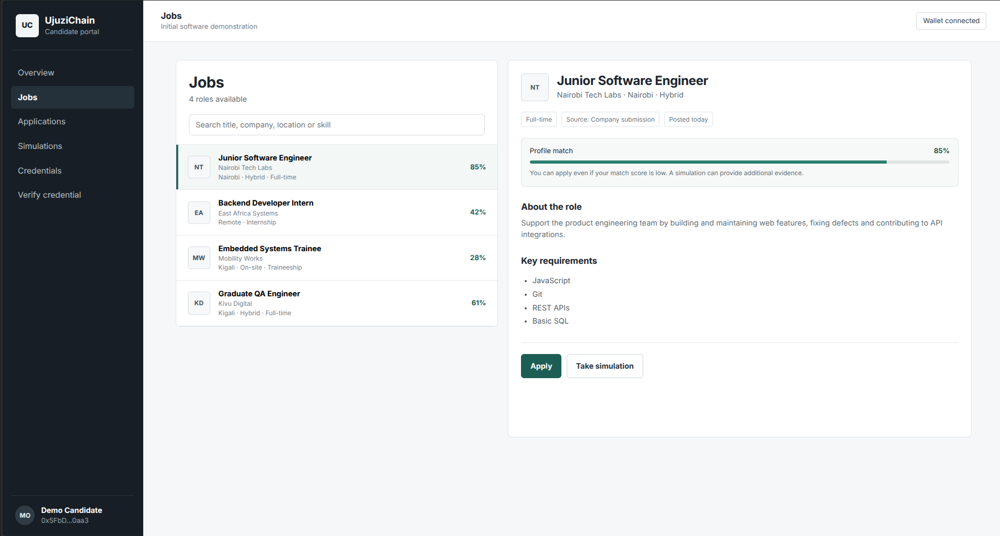

### Applications

The applications page shows jobs that the candidate has applied for.

Candidates are allowed to apply even when their verified qualifications do not completely match the job requirements.

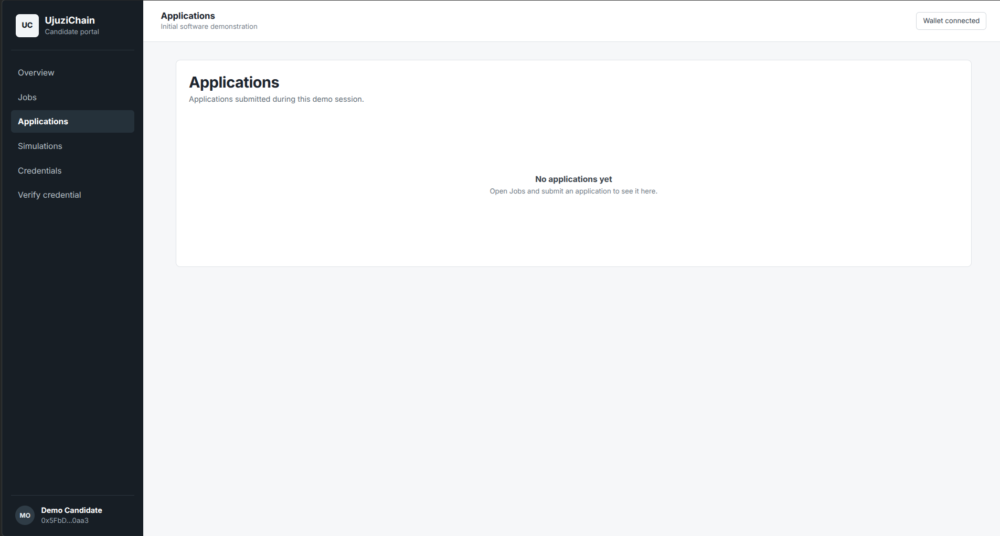

### Job Simulations

The simulation section provides practical assessments related to specific jobs.

A simulation gives candidates another way to demonstrate their ability beyond their verified qualifications and match score.

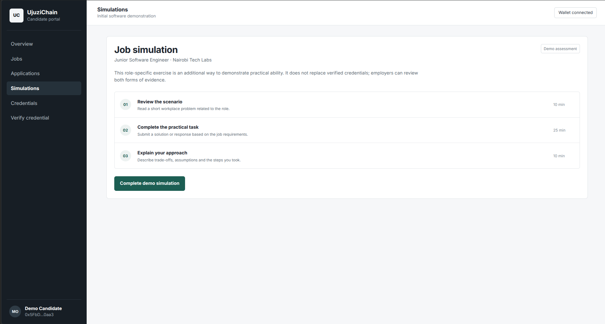

### Credentials

The credentials page shows qualifications associated with the candidate profile and their verification status.

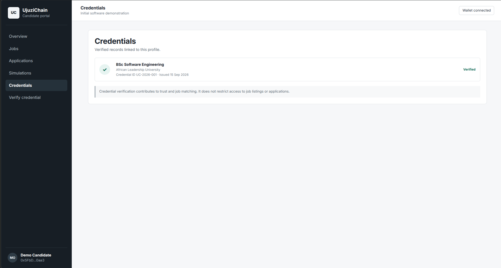

### Credential Verification

The verification interface allows credentials to be checked against the UjuziChain registry.

A credential can be shown as valid, active, or revoked depending on its blockchain record.

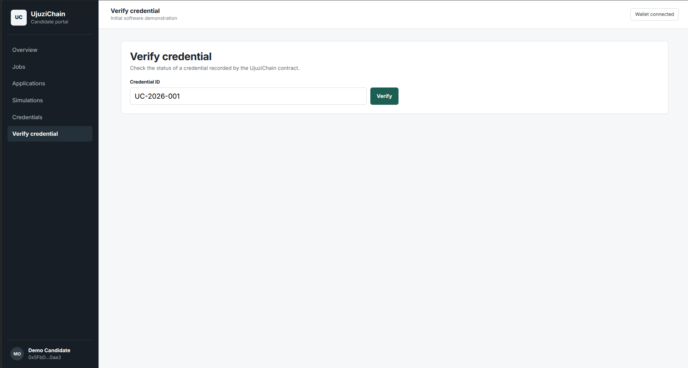

---

## Current MVP Flow

The current prototype demonstrates the following candidate flow:

1. Candidate creates or accesses a profile.
2. Verified credentials are associated with the candidate.
3. Candidate can browse all available jobs.
4. UjuziChain calculates a match score for each job.
5. The candidate can apply regardless of the match score.
6. The candidate can complete a job-specific simulation.
7. Simulation results provide additional evidence of practical ability.
8. Employers can consider verified credentials, match scores, simulations, and applications together.

---

## Screenshot Files

```text
applications.png
compiling.png
credentials.png
deployed-contract.png
hardhat-local-network.png
jobs.png
node-versions.png
overview.png
simulations.png
smart-contract-code.png
tests.png
verify-credential.png
